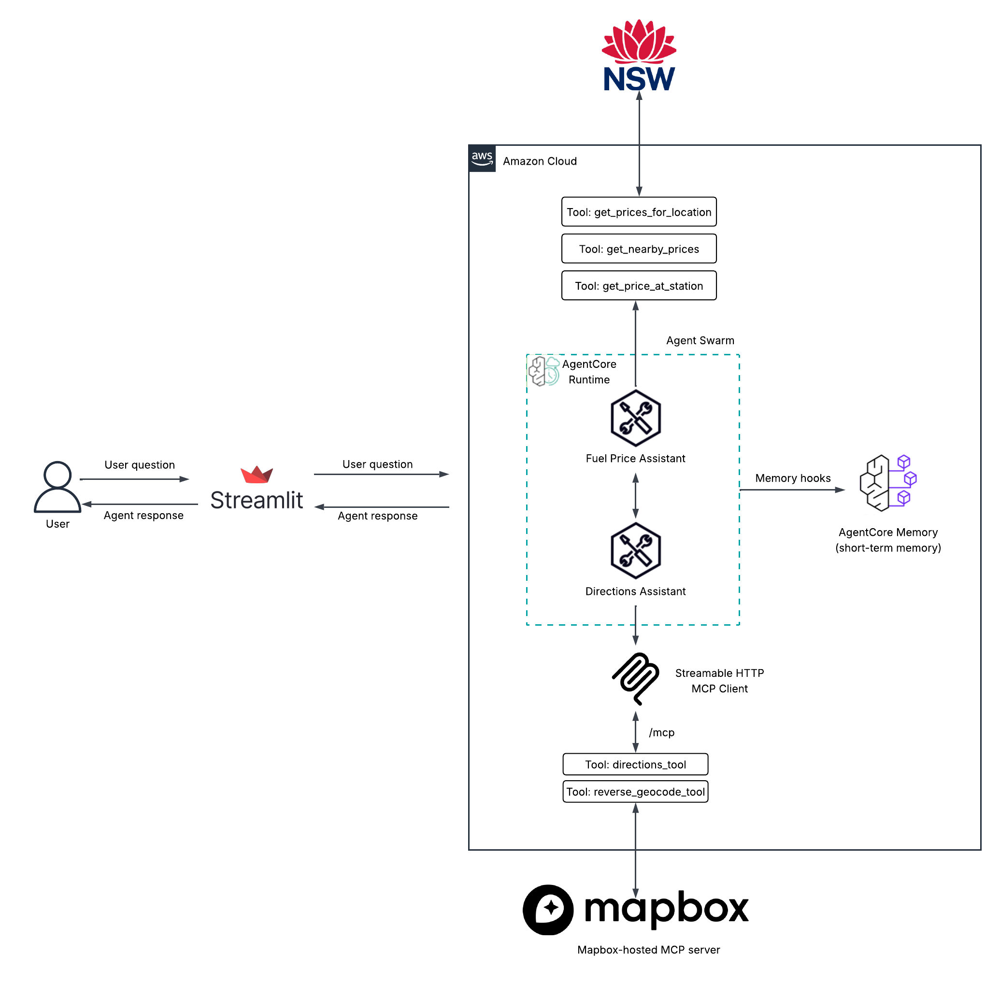

# Fuel Agent for New South Wales

## About
This is an agent that gives information on live fuel pricing across NSW service stations.
The agent utilizes [Fuel API](https://api.nsw.gov.au/Product/Index/22) published by NSW Department of Customer Service.

## Technology
It also makes use of [Mapbox MCP server](https://docs.mapbox.com/api/guides/mcp-server/)

## Architecture

Current architecture

### Swarm
This is a multi-agent system that utilizes the swarm collaboration pattern. This pattern uses a group of agents that work together on some task while exchanging information/state between them directly and iteratively. There is no central orchestrator and is a decentralized pattern.

### Agents-as-Tools
I also tried implementing this as an "agents-as-tools" pattern (see `agent-as-tool` branch for this implementation).

In this pattern, there is a primary "orchestrator" agent that calls a more specialized agents which are domain-specific to the various tasks. For this project, I have a main orchestrator agent that calls upon `fuel_price_assistant` and `directions_assistant` as tools.

I ultimately chose the swarm pattern because I found it to perform much faster than the agent-as-tool pattern. This is most likely due to it not having a centralized orchestrator agent that has to process the results coming in and out of the specialized agents.