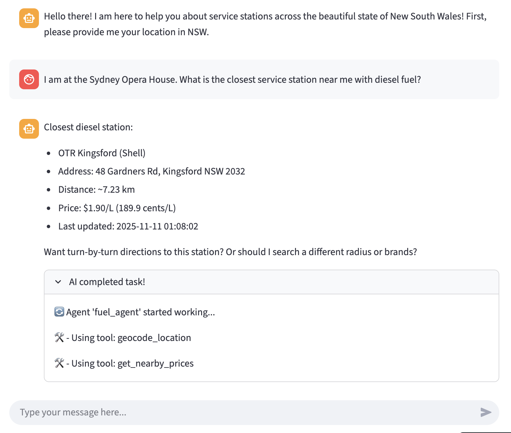

# Fuel Agent for New South Wales

You can access the app at: https://nsw-fuel-agent-smk1.streamlit.app/.

A screenshot of the chat bot with agents/tools used can be found below:

## About
This is an agent that gives information on live fuel pricing from service stations across the state of New South Wales (NSW) in Australia.
The agent utilizes [Fuel API](https://api.nsw.gov.au/Product/Index/22) published by NSW Department of Customer Service.

## Technologies Used

- [Strands Agents](https://strandsagents.com/latest/) (an open source agents SDK from AWS)
- [Amazon Bedrock AgentCore](https://aws.amazon.com/bedrock/agentcore/)
- [NSW Fuel API](https://api.nsw.gov.au/Product/Index/22)
- [Mapbox MCP server](https://docs.mapbox.com/api/guides/mcp-server/)
- [Streamlit](https://streamlit.io/)

## Architecture

Current architecture

The current state of this multi-agent system uses a swarm of agents, Mapbox MCP server, shared Agentcore Memory between agents, and deployed via Agentcore Runtime.

### Swarm
This is a multi-agent system that utilizes the swarm collaboration pattern. The swarm pattern uses a group of agents that work together on some task while exchanging information/state between them directly and iteratively. There is no central orchestrator and is a decentralized pattern.

### Agents-as-Tools
I initially tried implementing this as an "agents-as-tools" pattern (see `agent-as-tool` branch for this implementation).

In this pattern, there is a primary "orchestrator" agent that calls more specialized agents, which are domain-specific to various tasks. For this project, I have a main orchestrator agent that calls upon `fuel_price_assistant` and `directions_assistant` as tools. 

Ultimately, I decided on swarm because I found it to perform much faster than the agent-as-tool pattern. This is most likely due to it not having a centralized orchestrator agent that has to process the results coming in and out of the specialized agents.